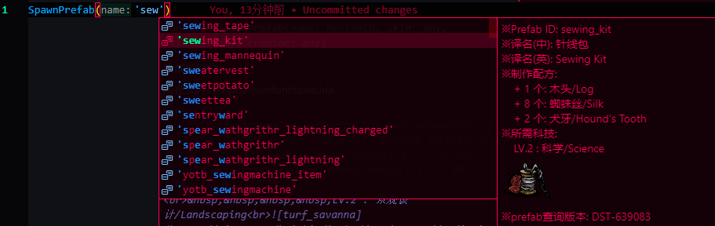

# LSP-dst

## 类及声明方法

#### 声明方法:

```lua
---@type 类型名
local spider
```

#### 目前的所有新类:

1. `ent` -> 实体类型 -> `class`
由`SpawnPrefab` `CreateEntity` 等方法生成.

2. `component_组件名` -> 组件类型 -> `class`

3. `componentID` -> 组件名类型 -> `string`

4. `PrefabID` -> 预制物ID类型 -> `string`



和 `p+预制物名` 的方法区别: 后者可以**通过中文搜英文**

5. `tagID` -> 标签名类型 -> `string`

6. `eventID` -> 事件名类型 -> `string`

7. `event_data_事件名` -> 事件表类型 -> `table`  哎 为什么lls不支持类型名拼接啊 有没有人能去提个issue啊(

8. `widget_xxx` -> widget类 -> `class`
